# ffmpeg-xcode

ffmpeg xcode project

## build steps

### step 1 编译 ffmpeg

* `tar xvf ffmpeg-3.0.2.tar.bz2`
* `cd ffmpeg-3.0.2`
* `./configure --enable-debug`
* `make -j8`

### step 2 新建一个空的 xcode 项目

* Create a new Xcode project
* 新建一个空的 xcode 项目
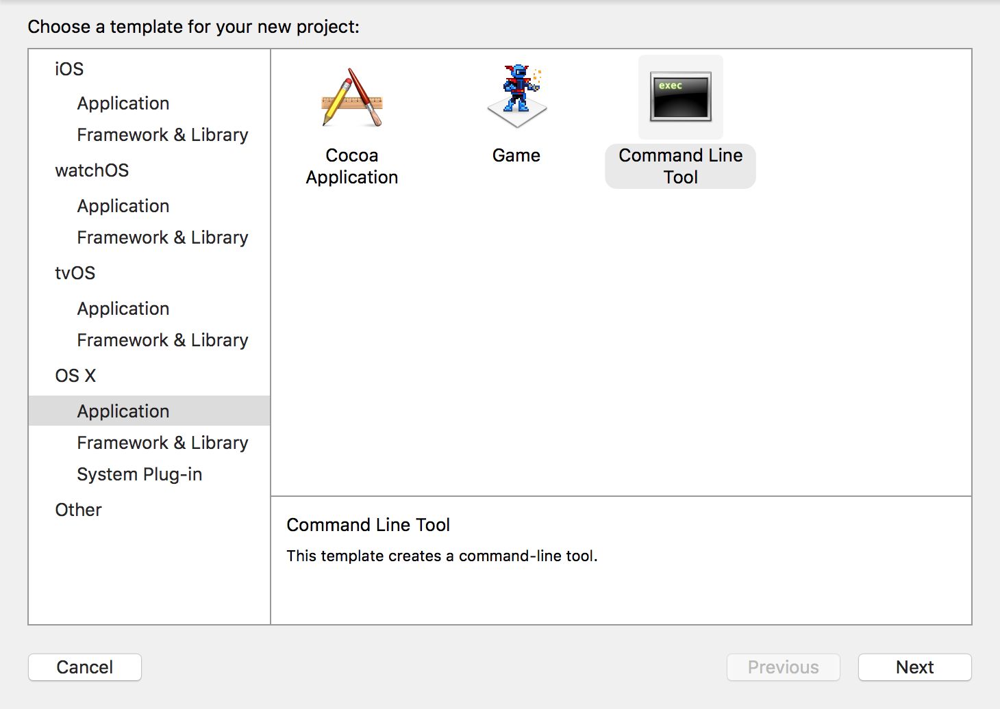
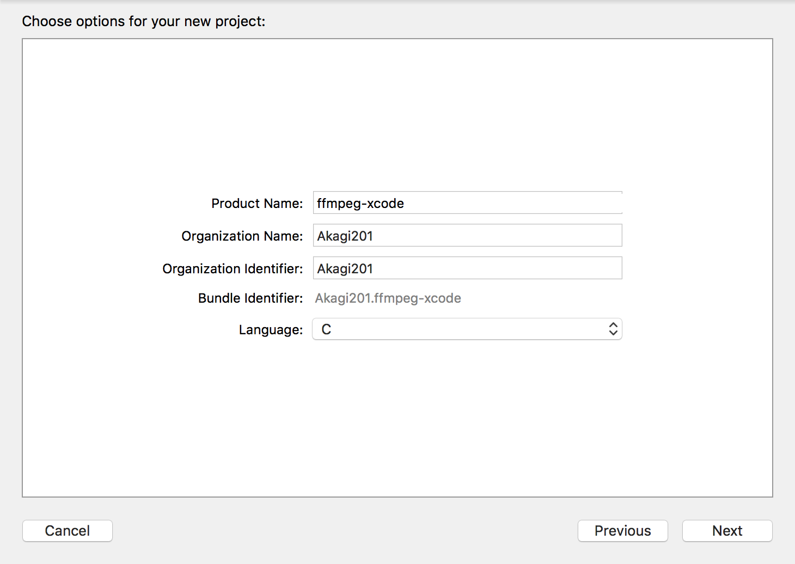
* 项目保存路径与`ffmpeg-3.0.2`同级.
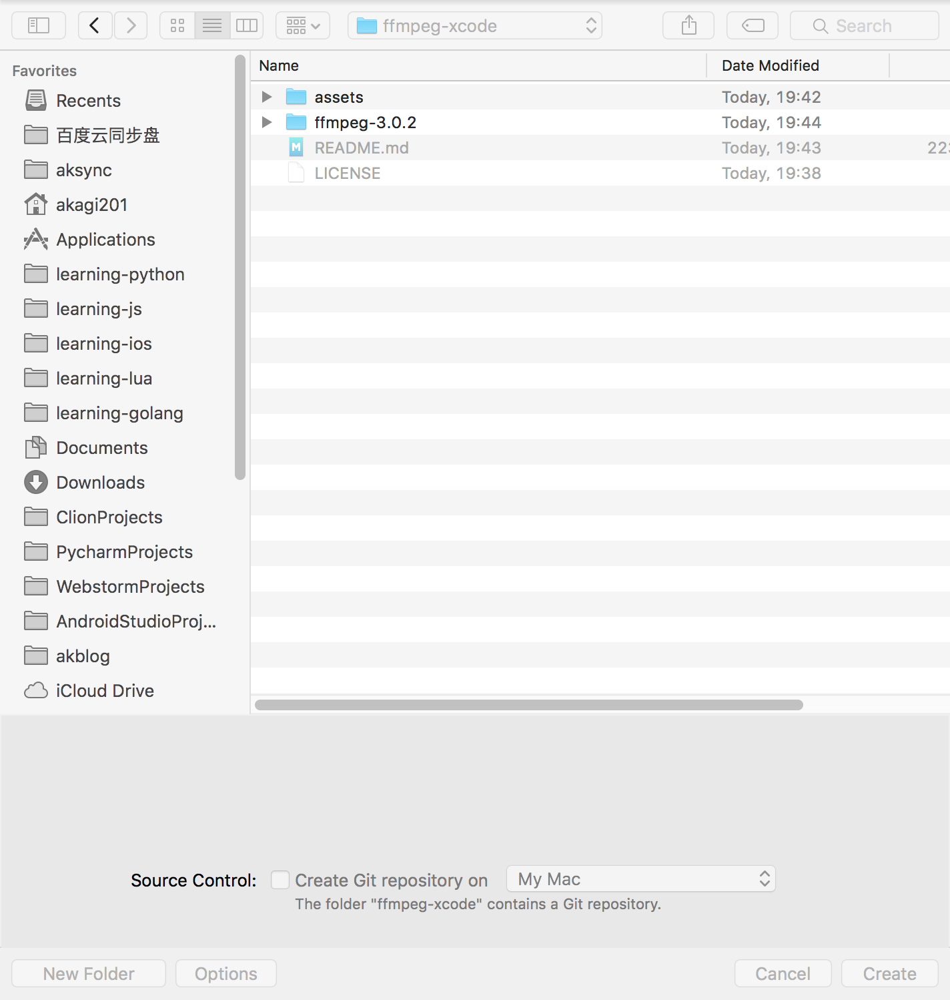

### step 3 添加 `ffmpeg-3.0.2` 源码目录进 `ffmpeg-xcode` 项目中

* 拖进去
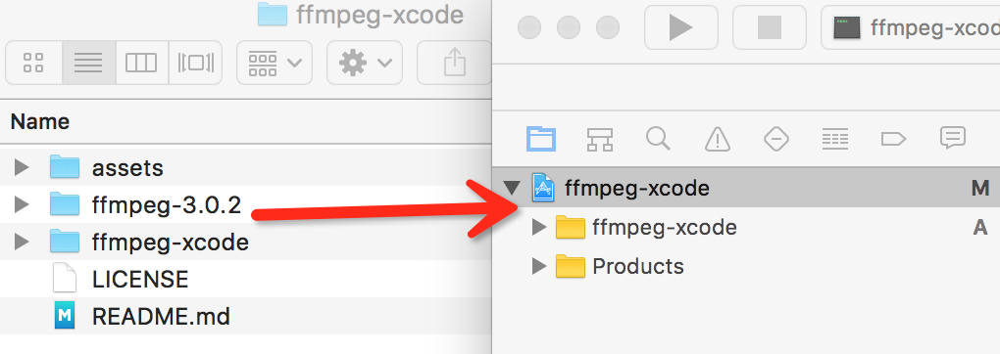
* 不要勾选下面这个选项
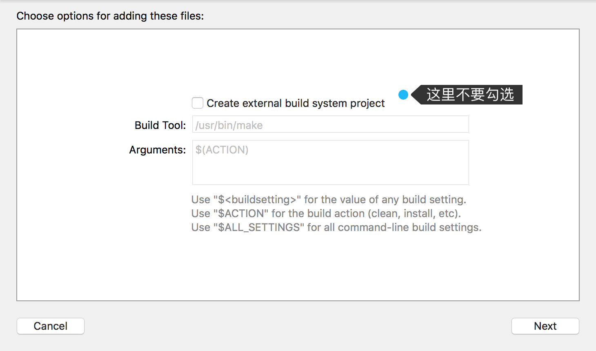
* 接着一点要选 `ffmpeg-xcode`, 否则看代码时, 不可以跳转. 写代码时不会有提示.

### step 4 添加头文件搜索路径

* 到这里就可以实现头文件跳转了. 要等待处理完毕才可以点击头文件或者类来查看代码.
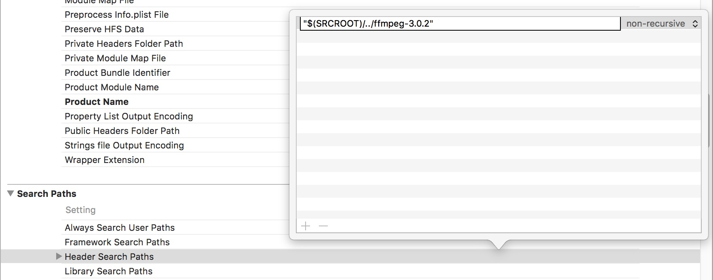

### step 5 添加一个 target

* `File -> New -> Target -> OS X -> Other -> External Build System`
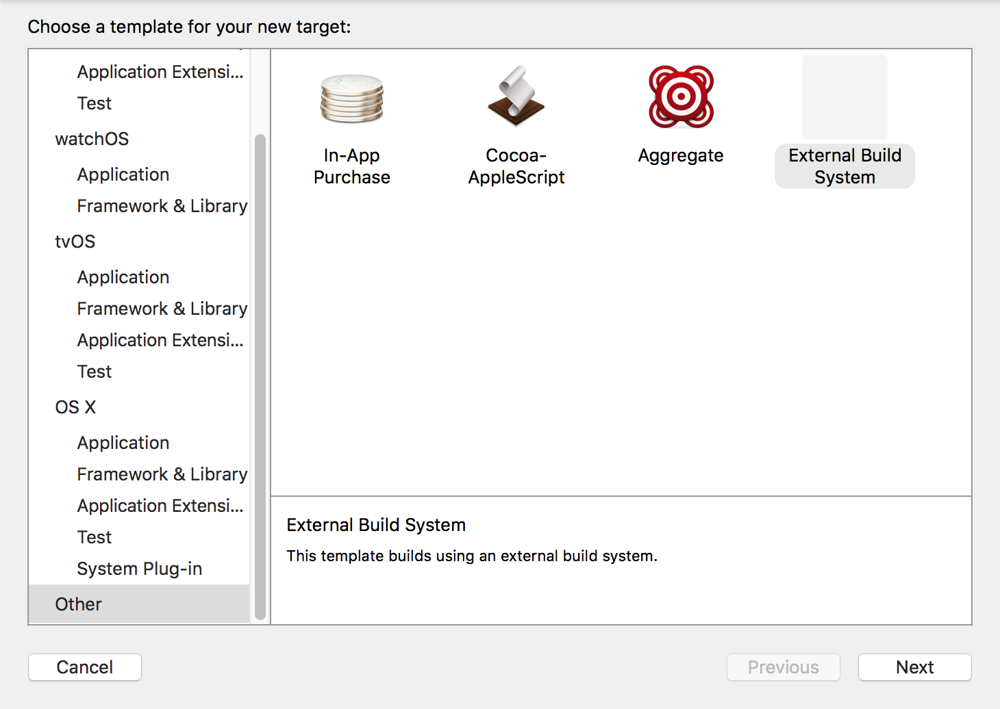
* target 命名为 `ffmpeg-make`
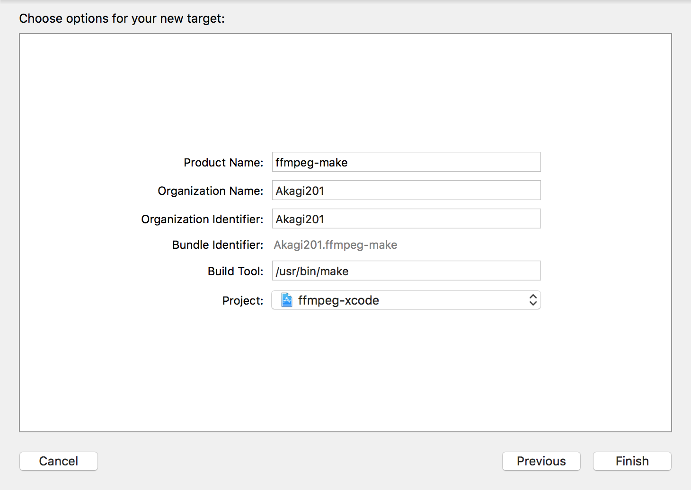
* target 切换到 `ffmpeg-make`
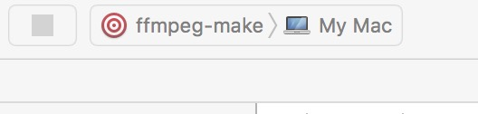

### step 6 修改 `ffmpeg-make` 源码路径配置

* 修改 `ffmpeg-make` 源码路径
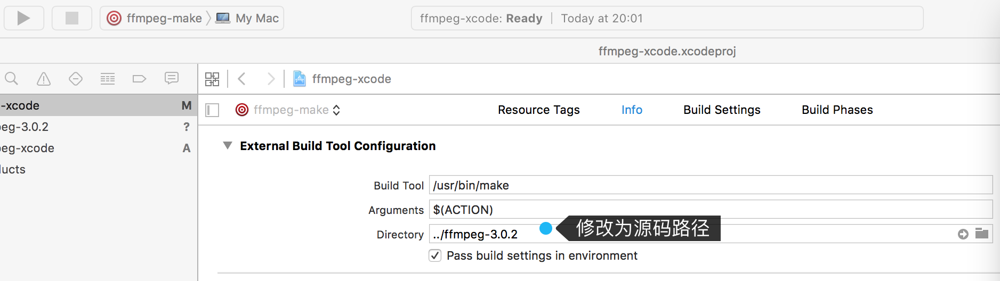

### step 7 修改 `ffmpeg-make` 命令行参数

* 修改命令行参数
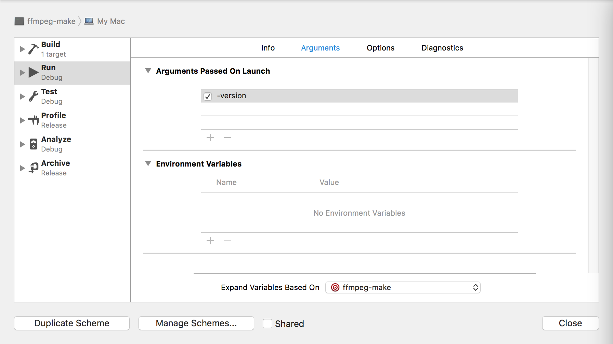
* 修改可执行命令
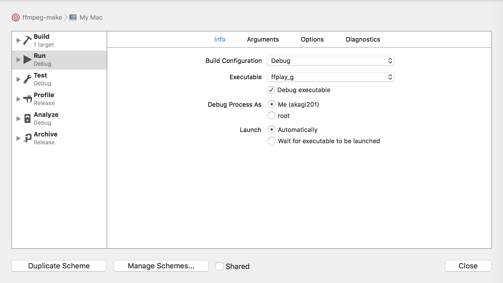

### step 8 添加断点(ffplay.c->main函数), 点击 run

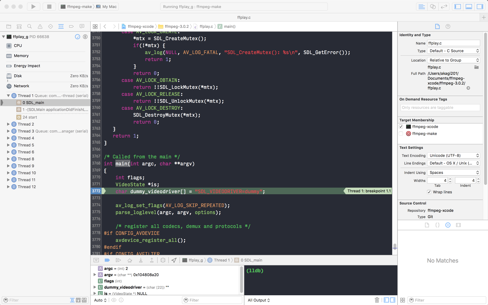
